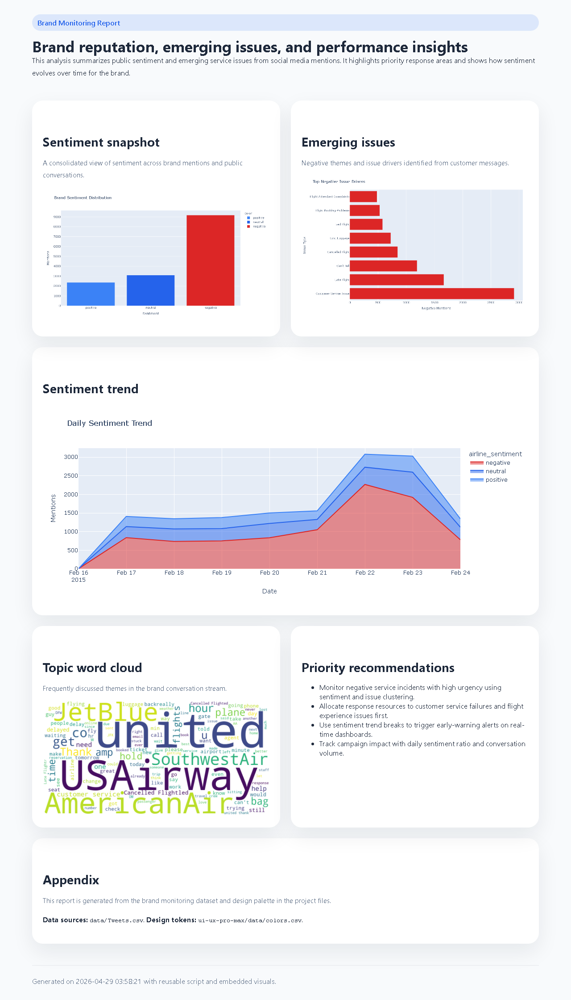

# Brand Monitoring

Monitors brand reputation on social media using NLP sentiment analysis, topic
modeling, and time series trend detection.

## Key Findings
- Sentiment snapshot across brand mentions: majority negative, split by positive/neutral/negative
- Identified top negative issue drivers (e.g. customer service, flight/booking problems)
- Tracked daily sentiment trend to surface spikes in negative mentions
- Topic word cloud surfaces the most frequently discussed themes in the conversation stream

## What I Did
- Processed social media mention data and classified sentiment
- Built a topic/issue clustering pass to rank negative themes by mention volume
- Charted sentiment trend over time to enable early-warning alerting
- Delivered priority response recommendations tied to sentiment and issue volume

## Report Preview

## Tools
Python · NLP · sentiment analysis · topic modeling · time series trend detection
